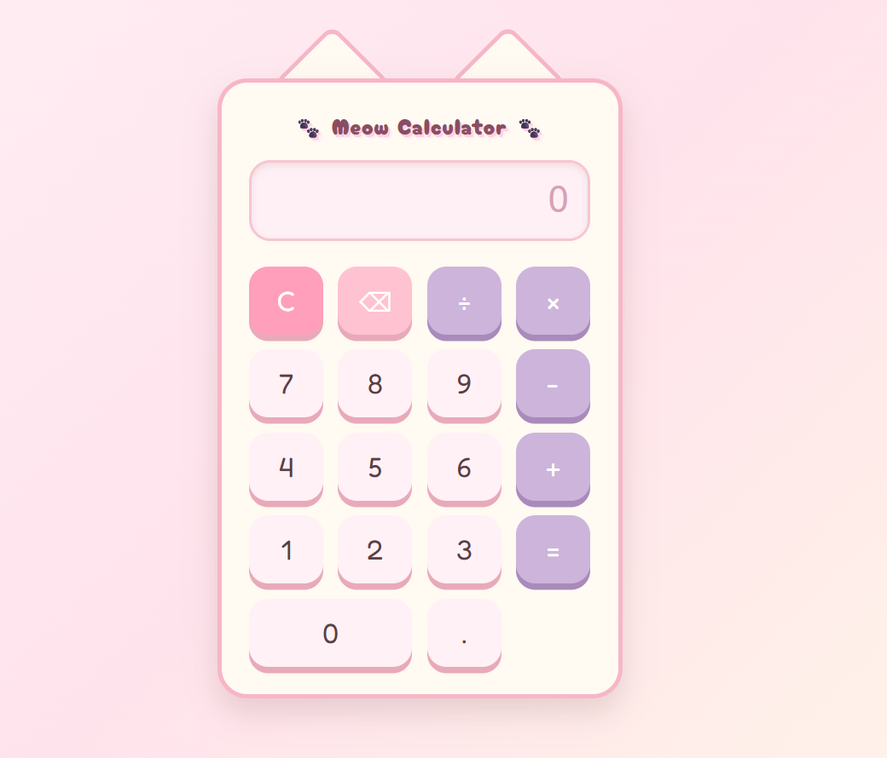

# 🐾 Meow Calculator

Meow Calculator is a cute cat-themed basic calculator built with HTML, CSS, and JavaScript.

## 🌐 Live Demo

[View Live Demo](https://axantina.github.io/Portfolio/Frontend/meow-calculator/)

## ✨ Features

- Basic arithmetic operations: addition, subtraction, multiplication, and division
- Clear button
- Backspace button
- Decimal number support
- Keyboard input support
- Responsive layout for laptop and mobile screen
- Cute cat-themed UI design

## 🛠️ Technologies Used

- HTML
- CSS
- JavaScript
- GitHub Pages

## 📚 What I Learned

Through this project, I practiced:

- Creating a web layout with HTML
- Styling a responsive user interface with CSS
- Handling button click events with JavaScript
- Using keyboard events in JavaScript
- Deploying a static website with GitHub Pages

## 📸 Screenshot

## 🚀 Future Improvements

- Add calculation history
- Add dark mode
- Add percentage calculation
- Add theme switcher
- Improve accessibility

---

# 🐾 Meow Calculator 日本語版

Meow Calculator は、HTML、CSS、JavaScript を使用して作成した、猫をテーマにしたかわいい基本計算機アプリです。

## 🌐 デモサイト

[デモを見る](https://axantina.github.io/meow-calculator/)

## ✨ 機能

- 足し算、引き算、掛け算、割り算の基本計算
- クリアボタン
- 1文字削除できるバックスペースボタン
- 小数点の入力対応
- キーボード入力対応
- PC・スマートフォン両方に対応したレスポンシブデザイン
- 猫をイメージしたかわいいUIデザイン

## 🛠️ 使用技術

- HTML
- CSS
- JavaScript
- GitHub Pages

## 📚 学んだこと

このプロジェクトを通して、以下を学習しました。

- HTML を使ったWebページの構成
- CSS を使ったUIデザインとレスポンシブ対応
- JavaScript によるクリックイベント処理
- キーボードイベントの実装
- GitHub Pages を使ったWebサイト公開

## 📸 スクリーンショット

## 🚀 今後追加したい機能

- 計算履歴の追加
- ダークモードの追加
- パーセント計算機能
- テーマ切り替え機能
- アクセシビリティの改善
